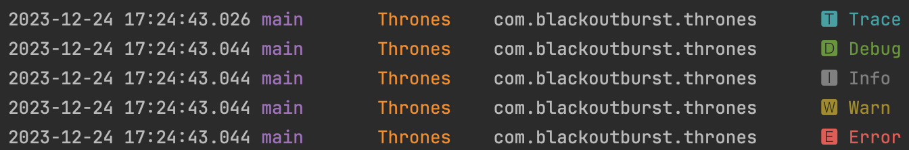

# Thrones
Lightweight logger api not planning

## Install
### Gradle
```gradle
repositories {
    maven {
        url = uri("https://maven.pkg.github.com/Blackoutburst/Thrones")
    }
}

dependencies {
    implementation("dev.blackoutburst:thrones:1.0.0")
}
```
### Maven
```xml
<dependency>
  <groupId>dev.blackoutburst</groupId>
  <artifactId>thrones</artifactId>
  <version>1.0.0</version>
</dependency>
```

## Usage
Code
```kotlin
Thrones.t("Trace")
Thrones.d("Debug")
Thrones.i("Info")
Thrones.w("Warn")
Thrones.e("Error")
```
Output


## Configuration
This is the default configuration
```kotlin
Thrones.configuration = ThronesConfiguration(
    level = ThronesLevel.INFO,
    showTime = true,
    showThread = true,
    showClass = true,
    showPackage = true,
    showIndicator = true,
)
```

### Level
- TRACE
- DEBUG
- INFO
- WARN
- ERROR

### Format
`<time> <thread> <class> <package> <indicator> <message>`
